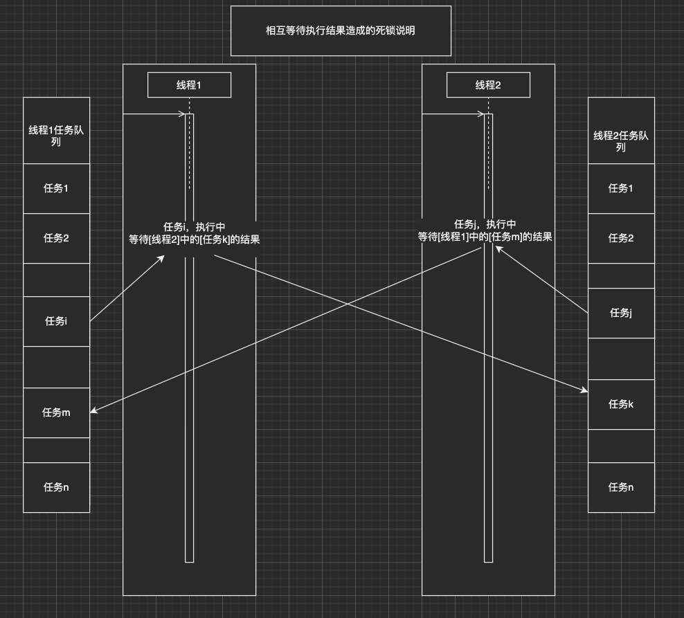

# Smart Thread Pool

[](https://gitlab.com/leosocy/SmartThreadPool/commits/master)
[](https://raw.githubusercontent.com/PalmID/ppic/master/LICENSE)

支持任务延迟执行的任务池

## Features

- Priority Task Queue
- Classify Thread Pool
- Self-Adaption Pool Capacity
- Pools & Queues State Monitor
- Support Task Async excute with delay  支持任务延迟执行
- Pool not exit when there is not task, bug wait new task forever 任务池没有任务时不自动退出,而是无限等待新任务到达

## Framework


## 注意事项

- 此任务线程池是可视为简化版的chrome线程模型，实现UI线程与IO线程分离，回避多线程操作同一对象造成的数据破坏，回避到处加锁造成的死锁。
- ApplyDelayAsync延迟执行比预定的时间点会有延迟，大概延迟0～5ms，
- 尽量不要等待函数的执行结果，而是有结果时异步通知。如下情况的相互等待造成的死锁，后果自负:


## Usage

- mvc模型使用线程池拆解示例，example_mvc.cpp：
```
/****************************************************************************\
 * Created on Mon Jul 30 2018
 * 
 * The MIT License (MIT)
 * Copyright (c) 2018 leosocy
 * 
 * Permission is hereby granted, free of charge, to any person obtaining a copy
 * of this software and associated documentation files (the ",Software"), to deal
 * in the Software without restriction, including without limitation the rights
 * to use, copy, modify, merge, publish, distribute, sublicense, and/or sell
 * copies of the Software, and to permit persons to whom the Software is
 * furnished to do so, subject to the following conditions:
 * The above copyright notice and this permission notice shall be included in all
 * copies or substantial portions of the Software.
 * 
 * THE SOFTWARE IS PROVIDED ",AS IS", WITHOUT WARRANTY OF ANY KIND, EXPRESS OR
 * IMPLIED, INCLUDING BUT NOT LIMITED TO THE WARRANTIES OF MERCHANTABILITY,
 * FITNESS FOR A PARTICULAR PURPOSE AND NONINFRINGEMENT. IN NO EVENT SHALL THE
 * AUTHORS OR COPYRIGHT HOLDERS BE LIABLE FOR ANY CLAIM, DAMAGES OR OTHER
 * LIABILITY, WHETHER IN AN ACTION OF CONTRACT, TORT OR OTHERWISE, ARISING FROM,
 * OUT OF OR IN CONNECTION WITH THE SOFTWARE OR THE USE OR OTHER DEALINGS IN THE
 * SOFTWARE.
\*****************************************************************************/

#include "smart_thread_pool.h"
using stp::SmartThreadPoolBuilder;
using stp::TaskPriority;
#define SmartThreadUIFlag "SmartThreadOfUI"
#define SmartThreadWorkerFlag "SmartThreadOfWorker"

#include <iostream>
#include <mutex>
#include <condition_variable>

std::shared_ptr<stp::SmartThreadPool> smartThreadPool; 

struct Viewer: public std::enable_shared_from_this<Viewer> {
  Viewer( std::string f){
    flag = f;
  }
  std::string flag;
  void onUserInputToSum(int from, int to);
  void updateUI(std::string str) {
    std::cout << str << std::endl;
  }
};

struct Controler: public std::enable_shared_from_this<Controler> {
  Controler( std::string f){
    flag = f;
  }
  std::string flag;
  void onSum(int from, int to);
};

struct Module: public std::enable_shared_from_this<Module> {
  Module( std::string f){
    flag = f;
  }
  std::string flag;
  void doSum(int from, int to);
};

std::shared_ptr<Viewer> getViewer(){
  static std::shared_ptr<Viewer> mgr(new Viewer(""));
  return mgr;
}
std::shared_ptr<Controler> getControler(){
  static std::shared_ptr<Controler> mgr(new Controler(""));
  return mgr;
}
std::shared_ptr<Module> getModule(){
  static std::shared_ptr<Module> mgr(new Module(""));
  return mgr;
}

void Viewer::onUserInputToSum(int from, int to) {
  smartThreadPool->ApplyAsync(SmartThreadUIFlag, TaskPriority::MEDIUM, std::bind(&Controler::onSum, getControler(), from, to));
}
void Controler::onSum(int from, int to){
  smartThreadPool->ApplyAsync(SmartThreadWorkerFlag, TaskPriority::MEDIUM, std::bind(&Module::doSum, getModule(), from, to));
  std::stringstream out;
  out << "sum from:" << from << " to:" << to << " 计算中，请稍等";
  smartThreadPool->ApplyAsync(SmartThreadUIFlag, TaskPriority::MEDIUM, std::bind(&Viewer::updateUI, getViewer(), out.str()));
}
void Module::doSum(int from, int to){
  std::this_thread::sleep_for(std::chrono::seconds(3));
  int sum = 0;
  for(int i = from; i <to; i++) {
    sum += i;
  } 
  std::stringstream out;
  out << "sum from:" << from << " to:" << to << " is: " << sum;
  smartThreadPool->ApplyAsync(SmartThreadUIFlag, TaskPriority::MEDIUM, std::bind(&Viewer::updateUI, getViewer(), out.str()));
}

void testMVC() {
  int from = std::rand() % 100;
  int to = std::rand() % 100;
  if (from > to) {
    int tmp = to; to = from; from = tmp;
  }
  smartThreadPool->ApplyAsync(SmartThreadUIFlag, TaskPriority::MEDIUM, std::bind(&Viewer::onUserInputToSum, getViewer(), from, to));
  smartThreadPool->ApplyDelayAsync(SmartThreadWorkerFlag, TaskPriority::MEDIUM,  std::chrono::seconds(6), testMVC);
}

int main(int argc, char** argv) {
  SmartThreadPoolBuilder builder;
  builder.AddClassifyPool(SmartThreadUIFlag, 1, 1)
    .AddClassifyPool(SmartThreadWorkerFlag, 1, 1);
  smartThreadPool = builder.BuildAndInit();

  //mvc使用线程池模拟，尽量不要等待函数的执行结果，而是有结果时异步通知。
  smartThreadPool->ApplyDelayAsync(SmartThreadWorkerFlag, TaskPriority::MEDIUM,  std::chrono::seconds(1), testMVC);

  smartThreadPool->StartAllWorkers();
  //任务池没有任务时不会主动退出，ctrl + c 退出
}

```

- 函数绑定示例，example.cpp：
```
#include "smart_thread_pool.h"
#include <iostream>


double my_divide(double x, double y) { 
  printf("my_divide\n");
  return x / y; }

struct MyPair {
  ~MyPair(){
    printf("MyPair destory\n");  
  }
  double a, b;
  double multiply() { 
    printf("MyPair::multiply | \n"); 
    return a*b;
  }
  double divide(double c, double d) { 
    printf("MyPair::divide | \n");
    return c/d; }
};

struct SharedMyPair {
  ~SharedMyPair(){
    printf("SharedMyPair destory\n");
  }
  SharedMyPair(double ap, double bp, std::string f){
    a = ap;
    b = bp;
    flag = f;
  }
  std::string flag;
  double a, b;
  double multiply() { 
    printf("SharedMyPair::multiply | \n");
    return a*b; }
  double divide(double c, double d) { 
    printf("SharedMyPair::divide | \n");
    return c / d; }
  double divideDelay(double c, double d) { 
    printf("SharedMyPair::divideDelay | flag:%s\n", flag.c_str());
    return c / d; }
};

int main(int argc, char** argv) {
  // ********************How to init `SmartThreadPool`********************
  //
  // using stp::SmartThreadPool;
  // using stp::SmartThreadPoolBuilder;
  // SmartThreadPoolBuilder builder;

  // ********Build by calling a chain.********
  // builder.AddClassifyPool(const char* pool_name,
  //                         uint8_t capacity,
  //                         uint8_t init_size);
  // ******** Such as:
  // builder.AddClassifyPool("DefaultPool", 16, 4)
  //        .AddClassifyPool("CPUBoundPool", 8, 4)
  //        .AddClassifyPool("IOBoundPool", 16, 8)
  // auto pool = builder.BuildAndInit();  // will block current thread
  //
  // ***********************************************************************

  // ******************************How to join a task******************************
  //
  // pool->ApplyAsync(function, args...);
  // ******** Such as:
  // 1. Run a return careless task.
  // pool->ApplyAsync("IOBoundPool", TaskPriority::MEDIUM, [](){ //DoSomeThing(args...); }, arg1, arg2, ...);
  //
  // 2. Run a return careful task.
  // auto res = pool->ApplyAsync("CPUBoundPool", TaskPriority::HIGH, [](int count){ return count; }, 666);
  // auto value = res.get();
  //
  // or you can set a timeout duration to wait for the result to become available.
  //
  // std::future_status status = res.wait_for(std::chrono::seconds(1)); // wait for 1 second.
  // if (status == std::future_status::ready) {
  //   std::cout << "Result is: " << res.get() << std::endl;
  // } else {
  //   std::cout << "Timeout" << std::endl;
  // }
  //
  // *******************************************************************************

  using stp::SmartThreadPoolBuilder;
  using stp::TaskPriority;
  SmartThreadPoolBuilder builder;
  builder.AddClassifyPool("DefaultPool", 1, 1)
    .AddClassifyPool("CPUBoundPool", 1, 1)
    .AddClassifyPool("IOBoundPool", 64, 32);
    //.EnableMonitor(std::chrono::seconds(5));
  auto pool = builder.BuildAndInit();

  for (int i = 0; i < 64; ++i) {
    for (unsigned char j = 0; j < 5; ++j) {
      pool->ApplyAsync("IOBoundPool", static_cast<TaskPriority>(j), [](int priority,  unsigned char i) {
        std::this_thread::sleep_for(std::chrono::seconds(5));
        printf("IOBoundPool priority:%d, %d\n", priority, i);
      },j, i);
    }
  }

  pool->ApplyAsync("IOBoundPool", TaskPriority::HIGH, [](){
    int repeat_times = 5;
    while (--repeat_times >= 0) {
      printf("IOBoundPool HIGH Task\n"); 
      std::this_thread::sleep_for(std::chrono::seconds(2));
    }
  });

  {
    //添加lambda函数OK
    auto res = pool->ApplyAsync("CPUBoundPool", TaskPriority::MEDIUM, [](int x, int y){
      return x + y;
    }, 1, 2);
    printf("added result: %d\n", res.get());
  }

  {
    //添加使用bind封装的无参函数OK
    auto res = pool->ApplyAsync("CPUBoundPool", TaskPriority::MEDIUM, std::bind(my_divide, 1, 2));
    //添加函数指针函数OK
    auto res1 = pool->ApplyAsync("CPUBoundPool", TaskPriority::MEDIUM, my_divide, 1, 2);
    printf("my_divide result: %f\n", res.get());
  }

  {
    MyPair mypair{ 1, 2 };
    auto res = pool->ApplyAsync("CPUBoundPool", TaskPriority::MEDIUM, std::bind(&MyPair::multiply, mypair));
    printf("multiply result: %f\n", res.get());
    auto res1 = pool->ApplyAsync("CPUBoundPool", TaskPriority::MEDIUM, std::bind(&MyPair::divide, mypair, 1, 2));
    printf("divide result: %f\n", res1.get());
  }

  {
    //添加shared_ptr对象OK
    std::shared_ptr<SharedMyPair> shard_pair(new SharedMyPair(1, 2, ""));
    auto res = pool->ApplyAsync("CPUBoundPool", TaskPriority::MEDIUM, std::bind(&SharedMyPair::divide, shard_pair, 1, 2));
    //添加mem_fn封装的类成员函数OK
    auto res1 = pool->ApplyAsync("CPUBoundPool", TaskPriority::MEDIUM, std::mem_fn(&SharedMyPair::divide), shard_pair, 1, 2);
    printf("shard_pair divide result: %f\n", res.get());
  }

  {
    std::shared_ptr<SharedMyPair> shard_pair1(new SharedMyPair(1, 2, "sleep 10000"));
    std::shared_ptr<SharedMyPair> shard_pair2(new SharedMyPair(1, 2, "sleep 6000"));
    std::shared_ptr<SharedMyPair> shard_pair3(new SharedMyPair(1, 2, "sleep 1000"));
    //添加延迟执行函数OK！！！
    auto res = pool->ApplyDelayAsync("CPUBoundPool", TaskPriority::MEDIUM, std::chrono::milliseconds(10000), std::mem_fn(&SharedMyPair::divideDelay), shard_pair1, 1, 2);
    auto res1 = pool->ApplyDelayAsync("CPUBoundPool", TaskPriority::MEDIUM, std::chrono::milliseconds(6000), std::bind(&SharedMyPair::divideDelay, shard_pair2, 1, 2));
    //添加延迟执行bind + placeholders函数OK！！！
    auto res2 = pool->ApplyDelayAsync("CPUBoundPool", TaskPriority::MEDIUM, std::chrono::milliseconds(1000), std::bind(&SharedMyPair::divideDelay, shard_pair3, 1, std::placeholders::_1), 2);
    printf("shard_pair3 divide result: %f\n", res2.get());
    printf("shard_pair2 divide result: %f\n", res1.get());
    printf("shard_pair1 divide result: %f\n", res.get());
  }
  pool->StartAllWorkers();
  //任务池没有任务时不会主动退出，ctrl + c 退出
}
```